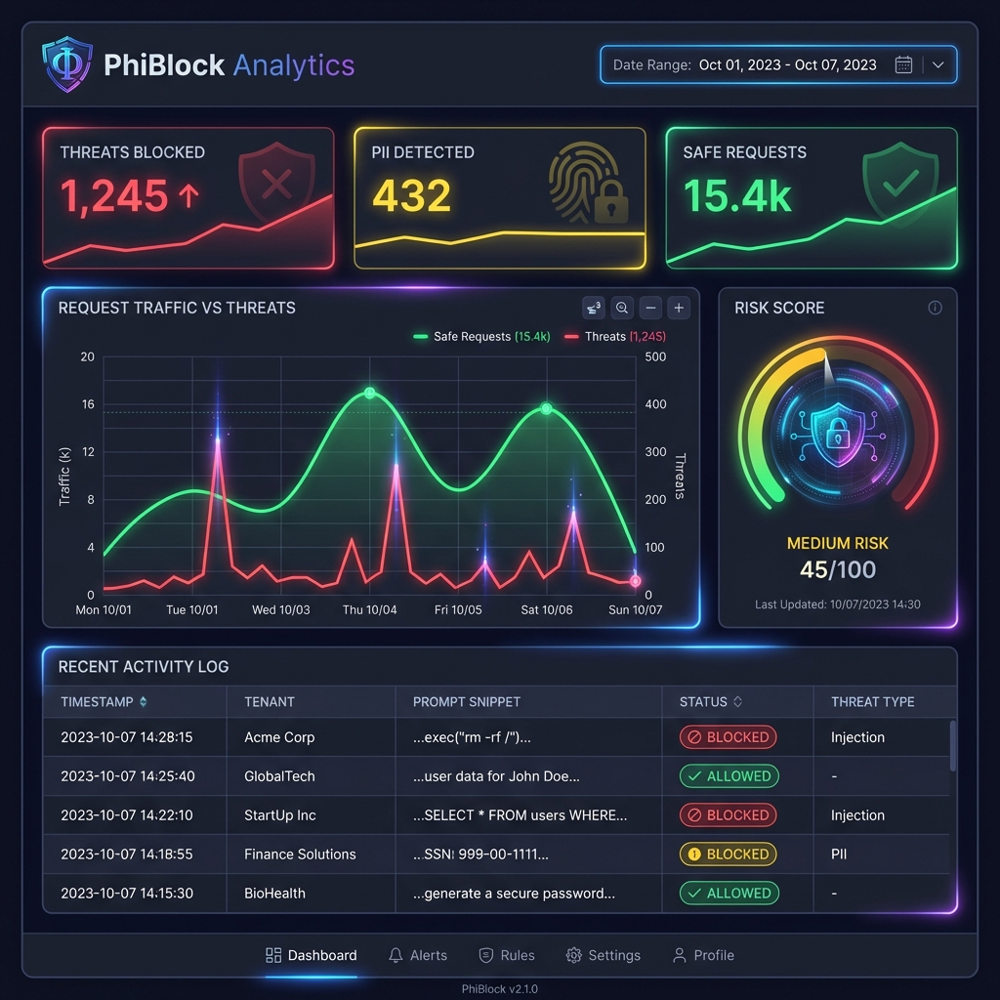

# 🛡️ PhiBlock API

**A Production-Ready AI Prompt Compliance & Security Layer**

PhiBlock is a real-time API firewall that filters AI prompts before they reach LLMs like OpenAI or Claude. It detects PII, blocks prompt injection attacks, redacts sensitive content, and enforces compliance rules for HIPAA, GDPR, and PCI-DSS.




[](LICENSE)
[](https://www.python.org/downloads/)
[](https://fastapi.tiangolo.com/)
[](https://github.com/monokpe/PhiBlock-API/actions/workflows/ci.yml)

---

## 🎯 Why PhiBlock-API?

**For Healthcare Startups** - Ensure HIPAA compliance for AI-powered tools
**For LLM Apps** - Add a security layer to Bubble, Retool, Zapier, and LangChain integrations
**For Compliance Teams** - Plug-and-play firewall for GPT-based systems with audit trails

### Key Problems Solved

- ✅ **PII Leakage Prevention** - Detect and redact sensitive data before it reaches third-party LLMs
- ✅ **Prompt Injection Defense** - Block malicious prompts attempting to manipulate AI behavior
- ✅ **Regulatory Compliance** - Enforce HIPAA, GDPR, PCI-DSS, and PIPEDA rules with contextual analysis
- ✅ **Enterprise Security** - Prevent leakage of secrets (AWS/Stripe keys) and proprietary documents
- ✅ **Multi-Tenant Security** - Strict data isolation for SaaS applications
- ✅ **Usage Tracking & Billing** - Token-level metering with Stripe integration

### 🌍 Real-World Scenarios

#### 🏥 Healthcare: HIPAA-Compliant Chatbots
Ensure that patient data (PHI) never leaves your infrastructure. PhiBlock intercepts chat messages, redacting names, conditions, and SSNs before they are sent to GPT-4, ensuring full HIPAA compliance alongside your BAA.

#### 💸 Fintech: Secure Customer Support
Prevent sensitive financial data from leaking into training datasets. Automatically redact credit card numbers (PCI-DSS) or account details while allowing general support queries to pass through.

#### 🛡️ Enterprise: Internal AI Tools
Protect your company IP. Detect and block employees from pasting proprietary code or internal memos into public LLMs, while maintaining an audit trail of all AI usage.

---

## ✨ Features

### 🔒 Security & Detection

- **PII Detection** - Regex + spaCy NLP for identifying names, emails, SSNs, phone numbers, etc.
- **Prompt Injection Detection** - HuggingFace transformer-based classifier
- **Content Redaction** - Smart replacement preserving context while removing sensitive data
- **Risk Scoring** - Weighted violation detection with configurable thresholds

### 📋 Compliance Engine

- **HIPAA Support** - PHI detection and electronic audit controls
- **GDPR Compliance** - Personal data classification and processing logs
- **PCI-DSS Rules** - Credit card and financial data protection
- **Enterprise Security** - Detection of AWS/Stripe keys and IP-protected confidential markers
- **Custom Frameworks** - Extensible rule system for additional compliance needs

### 🏢 Multi-Tenancy

- **API Key Authentication** - JWT-based secure access control
- **Tenant Isolation** - Database-level segregation of logs and analytics
- **Per-Tenant Rate Limiting** - Redis-backed request throttling
- **Webhook Notifications** - Real-time alerts for security events

### 📊 Analytics & Monitoring

- **GraphQL API** - Flexible querying for logs, usage stats, and violations
- **Analytics Dashboard** - Visual insights into threat patterns and API usage
- **Sentry Integration** - Error tracking and performance monitoring
- **Request Deduplication** - Redis caching for identical prompts (5-minute TTL)

### 💳 Billing & Usage

- **Stripe Metered Billing** - Automatic usage-based invoicing
- **Token Tracking** - Accurate OpenAI token counting with tiktoken
- **Celery Background Jobs** - Asynchronous billing aggregation
- **Audit Encryption** - AES-256-GCM encrypted audit logs

---

## 🚀 Quick Start

### 🐳 Docker Compose (Recommended for Production)

The fastest way to get up and running with a production-like environment (API, Redis, Worker).

```bash
# 1. Clone the repository
git clone https://github.com/monokpe/PhiBlock-API
cd PhiBlock-API

# 2. Configure Environment
cp .env.example .env
# Edit .env to set your secure keys (SECRET_KEY, API_KEY_SALT)

# 3. Start Services
docker-compose up -d --build
```

Access the API at `http://localhost:8000`

### 💻 Development Setup

If you prefer to run services individually for development:

#### 1. Prerequisites
- **Python 3.12+**
- **Redis** (optional, for caching and rate limiting)

#### 2. Install Dependencies
```bash
python -m venv venv
# Windows:
venv\Scripts\activate
# Linux/Mac:
source venv/bin/activate

pip install -r requirements.txt
python -m spacy download en_core_web_sm
```

#### 3. Configuration
```bash
cp .env.example .env
```
Ensure `REDIS_URL` points to your local Redis instance if enabled.

#### 4. Run Migrations & Start Server
```bash
alembic upgrade head
uvicorn app.main:app --reload
```

#### 5. Start Workers (Optional)
```bash
# Terminal 2: Worker
celery -A workers.celery_app worker --loglevel=info

# Terminal 3: Beat
celery -A workers.celery_app beat --loglevel=info
```

---

### ☁️ AWS EC2 Production Deployment

For a quick, budget-friendly demo on an AWS EC2 instance (e.g., `t3.medium`), use the automated deployment scripts:

#### 1. Prepare for Deployment
- Ensure you have your EC2 **Public IP** and **SSH Key (.pem file)**.
- Open **Port 8000** in your EC2 Security Group (Inbound Rules).

#### 2. Run the Push Script (on Windows)
Open PowerShell in the project root and run:

```powershell
.\scripts\push_to_ec2.ps1 -EC2_IP "3.123.45.67" -SSH_KEY_PATH "C:\path\to\your-key.pem"
```

This script will:
- 📦 Archive the project.
- 📤 Upload code to your EC2.
- 🛠️ Install Docker/Docker Compose (if missing).
- 🚀 Start the application.

#### 3. Access Your App
Once finished, visit your API docs at:
`http://<your-ec2-ip>:8000/docs`

---

## 📖 API Documentation

### REST Endpoints

| Endpoint                   | Method | Description                | Auth Required |
| -------------------------- | ------ | -------------------------- | ------------- |
| `/v1/health`               | GET    | Health check               | ❌            |
| `/v1/analyze`              | POST   | Analyze prompt for threats | ✅            |
| `/v1/tenants`              | POST   | Create new tenant          | ❌            |
| `/v1/tenants/{id}`         | GET    | Get tenant details         | ✅            |
| `/v1/tenants/{id}/keys`    | POST   | Generate API key           | ✅            |
| `/v1/analytics/usage`      | GET    | Get usage statistics       | ✅            |
| `/v1/analytics/violations` | GET    | Get compliance violations  | ✅            |

### Interactive Documentation

- **Swagger UI**: http://localhost:8000/docs
- **ReDoc**: http://localhost:8000/redoc

### GraphQL API

- **Endpoint**: http://localhost:8000/graphql
- **GraphiQL Playground**: Open endpoint in browser

#### Example GraphQL Query

```graphql
query {
  tenantLogs(tenantId: "123", limit: 10) {
    id
    prompt
    piiDetected
    injectionScore
    createdAt
  }
}
```

### Analytics Dashboard

- **URL**: http://localhost:8000/dashboard/
- **Access**: Requires valid Tenant API Key

---

## 🔧 Usage Examples

### 1. Create a Tenant

```bash
curl -X POST http://localhost:8000/v1/tenants \
  -H "Content-Type: application/json" \
  -d '{
    "name": "My Company",
    "plan": "pro"
  }'
```

Response:

```json
{
  "id": "550e8400-e29b-41d4-a716-446655440000",
  "name": "My Company",
  "slug": "my-company",
  "plan": "pro"
}
```

### 2. Analyze a Prompt

```bash
curl -X POST http://localhost:8000/v1/analyze \
  -H "Content-Type: application/json" \
  -H "X-API-Key: YOUR_API_KEY_HERE" \
  -d '{
    "prompt": "My name is John Doe and my SSN is 123-45-6789"
  }'
```

Response:

```json
{
  "request_id": "7c9e6679-7425-40de-944b-e07fc1f90ae7",
  "status": "completed",
  "sanitized_prompt": "My name is [PERSON] and my SSN is [SSN]",
  "detections": {
    "pii_found": true,
    "entities": [
      {
        "type": "PERSON",
        "value": "John Doe",
        "position": { "start": 11, "end": 19 }
      },
      {
        "type": "SSN",
        "value": "123-45-6789",
        "position": { "start": 34, "end": 45 }
      }
    ],
    "injection_detected": false,
    "injection_score": 0.0234
  },
  "cached": false
}
```

### 3. Python SDK Example

```python
import requests

API_KEY = "your-api-key-here"
BASE_URL = "http://localhost:8000"

headers = {
    "X-API-Key": API_KEY,
    "Content-Type": "application/json"
}

response = requests.post(
    f"{BASE_URL}/v1/analyze",
    headers=headers,
    json={"prompt": "Check if this contains sensitive data"}
)

result = response.json()
print(f"PII Found: {result['detections']['pii_found']}")
print(f"Sanitized: {result['sanitized_prompt']}")
```

---

## 🧪 Testing

Run the complete test suite:

```bash
# All tests
pytest

# With coverage
pytest --cov=app --cov-report=html

# Specific test file
pytest tests/test_detection.py -v
```

### Test Coverage Highlights

- ✅ Multi-tenancy isolation
- ✅ PII detection accuracy
- ✅ Prompt injection classification
- ✅ Compliance rule evaluation
- ✅ Token tracking and billing
- ✅ Webhook security validation
- ✅ GraphQL query authorization

### Code Quality Checks

Run all CI checks locally before pushing:

```bash
# Run all checks at once
.\scripts\check_ci.ps1

# Or run individually:
black --check app/ workers/
isort --check-only app/ workers/
flake8 app/ workers/ --max-line-length=100 --extend-ignore=E203,W503,D
mypy app/ workers/ --ignore-missing-imports
bandit -r app/ workers/ -ll
radon cc app/ workers/ -a
```

---

## 🏗️ Architecture

### Tech Stack

| Layer          | Technology                           |
| -------------- | ------------------------------------ |
| **Framework**  | FastAPI 0.109+                       |
| **Database**   | PostgreSQL 15+ (SQLAlchemy ORM)      |
| **Caching**    | Redis 5.0+                           |
| **NLP**        | spaCy 3.7+, HuggingFace Transformers |
| **ML Backend** | PyTorch (CPU-optimized)              |
| **Task Queue** | Celery 5.3+                          |
| **API Layer**  | GraphQL (Strawberry), REST           |
| **Auth**       | JWT (python-jose)                    |
| **Billing**    | Stripe 8.1+                          |
| **Monitoring** | Sentry 1.40+                         |
| **Migrations** | Alembic                              |
| **Frontend**   | HTML/JS + Chart.js                   |

### System Design

```
┌─────────────┐
│   Client    │
│ Application │
└──────┬──────┘
       │ HTTPS + API Key
       ▼
┌─────────────────────────────────────┐
│       PhiBlock API (FastAPI)        │
├─────────────────────────────────────┤
│  Rate Limiter → Auth → Middleware   │
└──────┬──────────────────────┬───────┘
       │                      │
       ▼                      ▼
┌─────────────┐        ┌──────────────┐
│   Redis     │        │  PostgreSQL  │
│  (Cache)    │        │  (Logs/Data) │
└─────────────┘        └──────────────┘
       │
       ▼
┌─────────────────────────────────────┐
│      Detection Pipeline             │
├─────────────────────────────────────┤
│  • spaCy NER (PII)                  │
│  • HuggingFace Classifier (Inject.) │
│  • Compliance Engine (Rules)        │
│  • Risk Scoring                     │
└─────────────────────────────────────┘
       │
       ▼
┌─────────────────────────────────────┐
│   Celery Workers (Background)       │
├─────────────────────────────────────┤
│  • Token Usage Aggregation          │
│  • Stripe Billing Sync              │
│  • Webhook Delivery                 │
└─────────────────────────────────────┘
```

---

## 📂 Project Structure

```
PhiBlock/
├── app/
│   ├── main.py              # FastAPI application entry point
│   ├── database.py          # SQLAlchemy setup
│   ├── models.py            # Database models (Tenant, APIKey, RequestLog)
│   ├── auth.py              # JWT authentication
│   ├── detection.py         # PII detection (spaCy)
│   ├── rate_limiting.py     # Redis-backed rate limiter
│   ├── cache_service.py     # Request deduplication
│   ├── tenant_api.py        # Tenant management endpoints
│   ├── analytics.py         # Usage analytics endpoints
│   ├── billing.py           # Stripe integration
│   ├── token_tracking.py    # Token usage metering
│   ├── webhooks.py          # Webhook management
│   ├── compliance/          # Compliance engine
│   │   ├── engine.py        # Rule evaluation
│   │   ├── redaction.py     # Content sanitization
│   │   ├── risk_scoring.py  # Violation scoring
│   │   └── definitions/     # Framework definitions
│   │       ├── hipaa.py
│   │       ├── gdpr.py
│   │       └── pci_dss.py
│   ├── graphql/             # GraphQL schema & resolvers
│   └── static/              # Analytics dashboard (HTML/JS)
├── workers/
│   ├── celery_app.py        # Celery configuration
│   └── detection.py         # Async injection detection
├── tests/                   # Comprehensive test suite
├── alembic/                 # Database migrations
├── docs/                    # Additional documentation
├── requirements.txt
├── Dockerfile
├── docker-compose.yml
└── README.md
```

---

## 🔐 Security Best Practices

### Webhook Security

- HMAC-SHA256 signature validation
- Replay attack prevention (timestamp validation)
- Configurable secrets per tenant

> [!NOTE]
> For a comprehensive production deployment checklist, please refer to our internal deployment documentation.

---

## 📊 Performance

- **Average Response Time**: < 200ms (cached), < 500ms (uncached)
- **Throughput**: 100+ requests/minute per tenant (default limit)
- **Cache Hit Rate**: ~70% for typical workloads
- **ML Model Load Time**: ~2-3 seconds on cold start
- **Token Tracking Accuracy**: 99.9% (tiktoken-based)

---

## 🛠️ Configuration Reference

### Environment Variables

| Variable            | Description                  | Default                         | Required |
| ------------------- | ---------------------------- | ------------------------------- | -------- |
| `DATABASE_URL`      | PostgreSQL connection string | `sqlite:///./phiblock_dev.db`   | No       |
| `REDIS_URL`         | Redis connection string      | `redis://localhost:6379/0`      | No       |
| `CACHE_ENABLED`     | Enable request caching       | `true`                          | No       |
| `SECRET_KEY`        | JWT signing key              | -                               | **Yes**  |
| `API_KEY_SALT`      | API key hashing salt         | -                               | **Yes**  |
| `STRIPE_API_KEY`    | Stripe secret key            | -                               | No       |
| `STRIPE_PRICE_ID`   | Stripe price ID for metering | -                               | No       |
| `SENTRY_DSN`        | Sentry error tracking URL    | -                               | No       |
| `CELERY_BROKER_URL` | Celery message broker        | `redis://localhost:6379/0`      | No       |
| `DEBUG`             | Enable debug mode            | `false`                         | No       |
| `LOG_LEVEL`         | Logging verbosity            | `INFO`                          | No       |

---

## 🗺️ Roadmap

### 🏆 Key Milestones Delivered

- **Core Security**: PII detection (spaCy), Prompt injection classifier (Transformers), and Multi-tenant architecture.
- **Compliance**: Full support for HIPAA, GDPR, PCI-DSS, and PIPEDA frameworks.
- **Integrations**: LangChain plugin, Stripe metered billing, and Sentry monitoring.
- **Performance**: Optimized database indexes, request deduplication (Redis), and async celery workers.
- **Quality Assurance**: Comprehensive CI/CD (black, isort, mypy, bandit) and 90%+ test coverage.

### 📝 Planned

- [ ] Real-time streaming analysis
- [ ] Custom model fine-tuning
- [ ] Multi-region deployment support

---

## 🤝 Contributing

Contributions are welcome! Please follow these steps:

1. Fork the repository
2. Create a feature branch (`git checkout -b feature/amazing-feature`)
3. Commit your changes (`git commit -m 'Add amazing feature'`)
4. Push to the branch (`git push origin feature/amazing-feature`)
5. Open a Pull Request

### Development Guidelines

- Write tests for new features (467 tests currently passing)
- Run local CI checks before pushing (`scripts/check_ci.ps1`)
- Follow PEP 8 style guide (enforced by black and flake8)
- Add type hints for new code (mypy checking enabled)
- Update documentation for API changes
- Ensure all tests pass (`pytest`)

---

## 📄 License

This project is licensed under the MIT License - see the [LICENSE](LICENSE) file for details.

---

## 🆘 Support

- **Files**: Check `/docs` and `/integrations` folders for detailed guides
- **Issues**: Open a GitHub issue for bugs or feature requests
- **Email**: [onokpejames@gmail.com](mailto:onokpejames@gmail.com)

---

## 🙏 Acknowledgments

- **spaCy**: NLP library for PII detection
- **HuggingFace**: Transformer models for prompt injection detection
- **FastAPI**: High-performance web framework
- **Stripe**: Payment infrastructure
- **Sentry**: Error tracking and monitoring

---

**Built with ❤️ for AI Safety & Compliance**
