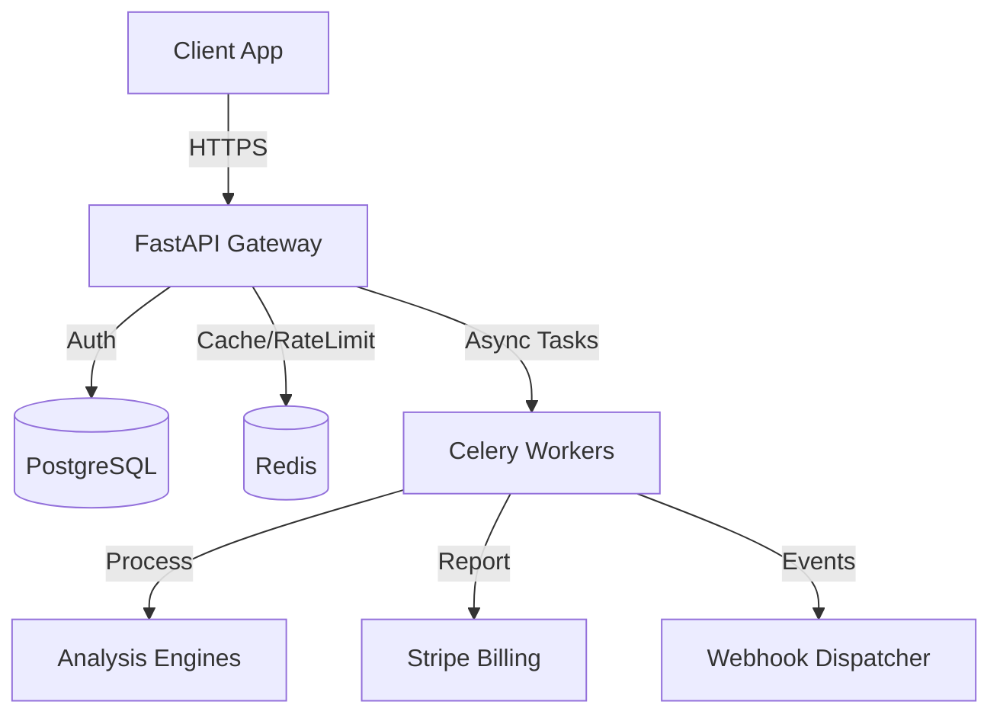

# Guardrails System Architecture

**Current Status:** Production Ready (Phase 2-5 Completed)
**Last Updated:** Dec 2025

## 1. System Overview

Guardrails is a high-performance content compliance and PII detection platform. It operates as a multi-tenant API services that analyzes text for sensitive information, compliance violations, and security risks.

### High-Level Components

## 2. Core Components

### 2.1 API Layer (FastAPI)
The entry point is a FastAPI application running under Gunicorn.
- **Routers**:
  - `v1/analyze`: Synchronous and Asynchronous text analysis.
  - `v1/tenants`: Tenant management.
  - `graphql`: Flexible data querying via Strawberry.
  - `v1/analytics`: Usage statistics.
- **Middleware**:
  - `TenantContextMiddleware`: Scopes requests to specific tenants.
  - `RequestSigningMiddleware`: Validates incoming webhook signatures.
  - `CORSMiddleware`: Handles cross-origin requests.

### 2.2 Worker Layer (Celery)
Asynchronous processing is handled by Celery workers using Redis as the broker.
- **Queues**:
  - `detection`: PII detection tasks (spaCy/Transformers).
  - `compliance`: Rule-based compliance checking.
  - `redaction`: Text redaction services.
  - `scoring`: Risk scoring and aggregation.
  - `default`: Billing sync and misc tasks.
- **Orchestration**: `analyze_complete_async` chains these tasks together.

### 2.3 Data Persistence
- **Primary DB**: SQLAlchemy ORM (PostgreSQL recommended for Prod).
  - Stores `Tenants`, `APIKeys`, `TokenUsage`, `AuditLogs`.
  - Migrations managed by Alembic.
- **Cache & State**: Redis (`REDIS_URL`).
  - Caches analysis results (`cache_service.py`).
  - Tracks rate limits (`rate_limiting.py`).
  - Stores Celery task state.

## 3. Key Workflows

### 3.1 Asynchronous Analysis
1. Client POSTs to `/v1/analyze/async`.
2. API creates a task ID and pushes `analyze_complete_async` to Celery.
3. Worker chains: `detect_pii` -> `check_compliance` -> `score_risk`.
4. Result is stored in Redis.
5. (Optional) Webhook is fired to client URL upon completion.

### 3.2 Metered Billing
1. Every API request logs usage to `TokenUsage` table.
2. Hourly Celery Beat task (`sync_usage_to_stripe`) aggregates unreported usage.
3. Usage is reported to Stripe for the tenant's subscription item.
4. `TokenUsage` records are marked as `reported_to_stripe=True`.

### 3.3 Security & Compliance
- **PII Detection**: Hybrid approach using spaCy and regex patterns.
- **Compliance**: Rule engine supporting multiple frameworks (GDPR, HIPAA).
- **Redaction**: Replaces sensitive data with tokens, masks, or hashes.
- **Webhooks**: Signed with HMAC-SHA256 (`X-Guardrails-Signature`) for authenticity.

## 4. Deployment & Infrastructure

- **Containerization**: Docker multi-stage build.
- **Process Management**: Gunicorn with Uvicorn workers.
- **Startup**: `entrypoint.sh` automatically runs DB migrations (`alembic upgrade head`).
- **Configuration**: Fully 12-factor app compliant (Environment Variables).

## 5. Development Interfaces
- **GraphQL**: `/graphql` for flexible querying of analysis results.
- **Sentry**: Integrated for error tracking and performance monitoring.
